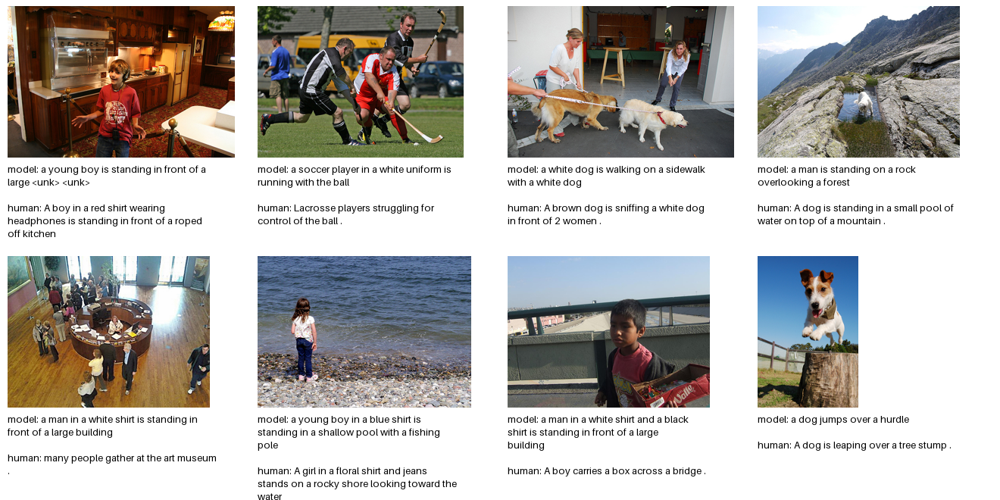

# Image Captioning using CNN + LSTM

[](https://github.com/lalith0087/IMAGE-CAPTIONING-using-CNN-and-LSTM/actions/workflows/ci.yml)

Generates natural-language captions for images using a pretrained CNN
(InceptionV3) encoder and an LSTM decoder, trained on the Flickr8k dataset.

## 1. Get the data

Download the Flickr8k dataset (images + captions) and place it like this:

```
data/
  Flickr8k_Dataset/        # all .jpg images
  Flickr8k.token.txt       # image_name#caption_id \t caption text
```

Common sources: Kaggle "Flickr8k" dataset, or the original Illinois request form.
Unzip so that `data/Flickr8k_Dataset/*.jpg` and `data/Flickr8k.token.txt` exist.

## 2. Install dependencies

```
pip install -r requirements.txt
```

## 3. Preprocess: build vocabulary

```
python scripts/build_vocab.py
```

This caches a `vocab.pkl` built from every caption's word frequencies.

## 4. Train

```
python scripts/train.py --epochs 20 --batch-size 32
```

The encoder fine-tunes the last Inception block (`Mixed_7a` onward) instead
of using frozen precomputed features, so every training step runs the full
CNN forward pass on raw images — slower per epoch than a frozen-feature
setup, but the visual features adapt to the captioning task and to whatever
images you train on. Use `--cnn-lr` to control the (lower) learning rate for
those fine-tuned CNN layers separately from `--lr` for the projection + LSTM.

Checkpoints are saved to `checkpoints/`.

## 5. Generate a caption for a new image

```
python scripts/predict.py --image path/to/image.jpg --checkpoint checkpoints/best.pth
```

## 6. Web demo

```
python webapp/app.py
```

Then open http://localhost:5000, upload an image, and see the generated caption.

## 7. Evaluate (BLEU)

```
python scripts/evaluate.py --expect-fingerprint 2a827395ba5d8c39     # BLEU-1..4 on the held-out split
python scripts/evaluate.py --limit 64                                # quick smoke test
```

`train.py` holds out 10% of the images with a fixed seed (42). `evaluate.py` rebuilds exactly that
split (809 images), decodes each image greedily and scores the caption against all five human
references with corpus BLEU (NLTK). It writes `results/metrics.json`, `results/captions.json` and
`results/samples.png`, and reports the share of distinct captions, which exposes a model that repeats
a few generic sentences. To train and evaluate on a free GPU, open
[`notebooks/colab_train_eval.ipynb`](notebooks/colab_train_eval.ipynb) in Google Colab.

**The split depends on the dataset copy.** It is a seeded random draw over the sorted image
filenames, so a different Flickr8k mirror (different filenames or count) yields a different split.
The results below use the public mirror the Colab notebook downloads
(`jbrownlee/Datasets`: 8,091 images, 40,460 caption lines). `evaluate.py` fingerprints the held-out
set (`2a827395ba5d8c39` for that run) and `--expect-fingerprint` refuses to score on a mismatched copy.
This matters: re-scoring the same checkpoint on a different local copy gave a higher BLEU-4 (0.158 vs
0.128), most likely because that copy's "held-out" images were not the ones held out in training. That
number is not a valid held-out score and is not used.

### Results (20 epochs, T4 GPU, greedy decoding)

| BLEU-1 | BLEU-2 | BLEU-3 | BLEU-4 | distinct captions | avg length |
|---|---|---|---|---|---|
| 0.498 | 0.322 | 0.202 | 0.128 | 54.1% | 12.4 words |

Validation loss fell from 3.70 (epoch 1) to 2.62 (epoch 20) and was still improving at the end.
The same split also selected the checkpoint (lowest validation loss), so these are validation scores,
not a fully untouched test set. The trained weights (118 MB) are not stored in the repo.



**Known weaknesses of this baseline** (measured on all 809 held-out captions):
- **Repetition:** 72 captions (9%) run into the 20-word limit mid-sentence, and one caption
  ("a woman in a white shirt and a black shirt and a woman in a blue shirt and blue jeans") appears 19 times.
- **`<unk>` tokens** show up in 79 captions (9.8%).
- **Generic vocabulary:** only 231 of the 2,982 vocabulary words are ever used, and 27% of captions start with "a man in a".
- **Undertrained:** each epoch shows one random caption per image, and the loss had not flattened.
- **Attribute errors:** e.g. a girl described as "a young boy in a blue shirt".

Next steps: beam search with a repetition penalty, hiding `<unk>`, and a longer run (40 epochs), scored
the same way and compared with this baseline.

Tests for the evaluation code (`pytest tests`) check that the batched decoder matches the
single-image decoder, that the split matches training, and the dataset-fingerprint guard.

## Architecture

- **Encoder**: pretrained InceptionV3 (ImageNet weights). Layers up to
  `Mixed_7a` stay frozen; `Mixed_7a` onward is fine-tuned so the CNN adapts
  to the captioning task. The 2048-d pooled output is projected to the
  embedding dimension.
- **Decoder**: LSTM that takes the image embedding as the first input, then
  generates the caption token-by-token, trained with teacher forcing and
  cross-entropy loss (padding tokens masked).
- **Inference**: greedy or beam-search decoding starting from `<start>`, ending
  at `<end>` or a max length.
